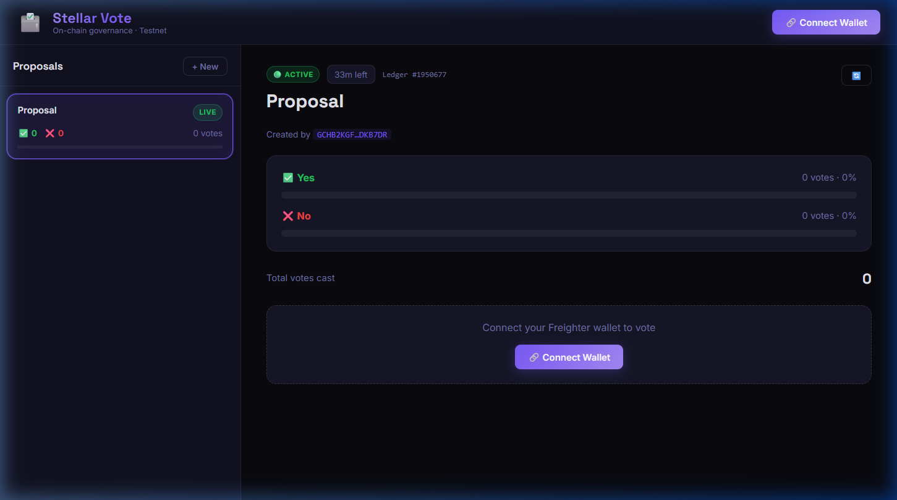
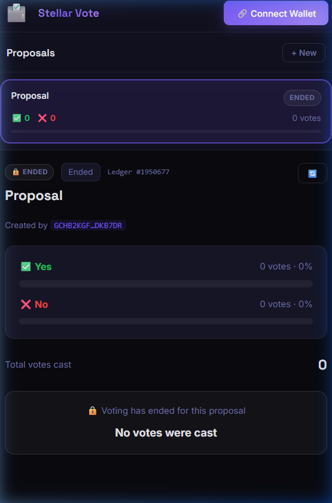

# 🗳️ Stellar Vote — On-Chain Governance dApp

> **Level 4 Green Belt Submission** · Stellar Testnet · Soroban Smart Contracts

A fully decentralized voting application built on the Stellar blockchain using Soroban smart contracts. Users connect their **Freighter wallet**, create on-chain proposals, and cast tamper-proof yes/no votes — all enforced by smart contract logic.

---

## ✅ Submission Checklist

| Requirement | Status |
|---|---|
| Live Demo (Vercel/Netlify) | ✅ [https://stellar-green-belt-silk.vercel.app](https://stellar-green-belt-silk.vercel.app) |
| Mobile-Responsive Screenshot | ✅ See [Screenshots](#-screenshots) below |
| CI/CD Pipeline | ✅ GitHub Actions — see [`.github/workflows/deploy.yml`](.github/workflows/deploy.yml) |
| Smart Contract Address | ✅ `CAZLCX7HB4K7VUXBIO27UODIHGVOJ3FGVWK5BTEVHGN275RKEVVE4KEX` |
| No inter-contract calls in this project | ✅ Single voting contract (no token/pool) |

---

## 📸 Screenshots

### Desktop View


### Mobile View


---

## 🔗 Contract Addresses (Testnet)

| Contract | Address |
|---|---|
| **Voting Contract** | `CAZLCX7HB4K7VUXBIO27UODIHGVOJ3FGVWK5BTEVHGN275RKEVVE4KEX` |

> View on [Stellar Expert (Testnet)](https://testnet.stellar.expert/explorer/testnet/contract/CAZLCX7HB4K7VUXBIO27UODIHGVOJ3FGVWK5BTEVHGN275RKEVVE4KEX)

---

## ⚙️ CI/CD Pipeline

This project uses **GitHub Actions** to automatically build the frontend and verify the smart contracts (formatting, testing, and compilation) on every push to `main`.

```yaml
# .github/workflows/deploy.yml
name: CI/CD Pipeline
on:
  push:
    branches: [main]

jobs:
  build_frontend:
    runs-on: ubuntu-latest
    steps:
      - uses: actions/checkout@v3
      - uses: actions/setup-node@v3
        with: { node-version: 18 }
      - run: npm install
        working-directory: ./frontend
      - run: npm run build
        working-directory: ./frontend

  build_test_contracts:
    runs-on: ubuntu-latest
    steps:
      - uses: actions/checkout@v3
      - uses: dtolnay/rust-toolchain@stable
        with: { targets: wasm32-unknown-unknown }
      - run: cargo fmt --all -- --check
        working-directory: ./contracts
      - run: cargo test
        working-directory: ./contracts
      - run: cargo build --target wasm32-unknown-unknown --release
        working-directory: ./contracts
```


> ⚠️ Replace `YOUR_USERNAME/YOUR_REPO` above with your actual GitHub repository path.

---

## 📝 Overview

**Stellar Vote** is a decentralized governance dApp where:

- Any wallet can **create a proposal** with a title, description, and voting duration
- Any wallet can **vote Yes or No** on open proposals
- Votes are enforced **on-chain** — one vote per wallet, no voting after expiry
- Results are final and tamper-proof once the voting period ends

### Key Features

- **Soroban Smart Contract**: Written in Rust, deployed on Stellar Testnet
- **Freighter Wallet Integration**: `@stellar/freighter-api` for secure transaction signing
- **Real-time Vote Bars**: Animated progress bars with live % breakdown
- **Time-Aware UI**: Proposals display countdown (e.g. "44m left"), lock when expired
- **Mobile Responsive**: Fully stacked single-column layout on small screens
- **Premium Dark UI**: Deep-space glassmorphism design with violet/indigo gradients
- **CI/CD**: GitHub Actions pipeline validates every build automatically

---

## 📦 Contract Functions

| Function | Args | Description |
|---|---|---|
| `create_proposal` | `creator, title, description, duration_ledgers` | Creates a new on-chain proposal |
| `vote` | `voter, proposal_id, approve: bool` | Casts a yes/no vote (requires auth, one per wallet) |
| `get_proposal` | `proposal_id` | Returns full proposal data |
| `get_proposal_count` | — | Returns total number of proposals |

---

## 💻 Tech Stack

| Layer | Technology |
|---|---|
| Smart Contracts | Rust, Soroban SDK v22 |
| Frontend Framework | React 18 + Vite 5 |
| Blockchain SDK | `@stellar/stellar-sdk` v14 |
| Wallet | `@stellar/freighter-api` v6 |
| Styling | Vanilla CSS — Space Grotesk + Inter fonts |
| CI/CD | GitHub Actions |

---

## 🚀 Local Setup

### Prerequisites
- [Freighter Extension](https://www.freighter.app/) installed and set to **Testnet**
- Node.js v18+
- Free testnet XLM from [Stellar Friendbot](https://friendbot.stellar.org)

### Run Frontend

```bash
cd frontend
npm install
npm run dev
```

Visit `http://localhost:5173`

### Build Soroban Contract (optional)

```bash
cd contracts
stellar contract build --package voting
stellar contract deploy --package voting --network testnet --source <your-identity>
```

---

## 📖 How to Use

1. **Connect Wallet** — Click "Connect Wallet" → approve in Freighter
2. **Create Proposal** — Click "+ New", fill in title + description + duration, submit
3. **Vote** — Click a proposal card, then "Vote Yes" or "Vote No"
4. **View Results** — Vote bars update live; expired proposals show final verdict

---

## 📖 Git History

This project was built with **10+ meaningful commits** tracking the full lifecycle:
contract architecture → Soroban deployment → frontend integration → responsive design → CI/CD setup.
